# Architecture — `turboquant_consumer`

Implementation of Google's **TurboQuant** algorithm (ICLR 2026, arXiv 2504.19874) for compressing transformer KV caches to 3–4 bits per coordinate on consumer GPUs.

---

## High-Level Module Map

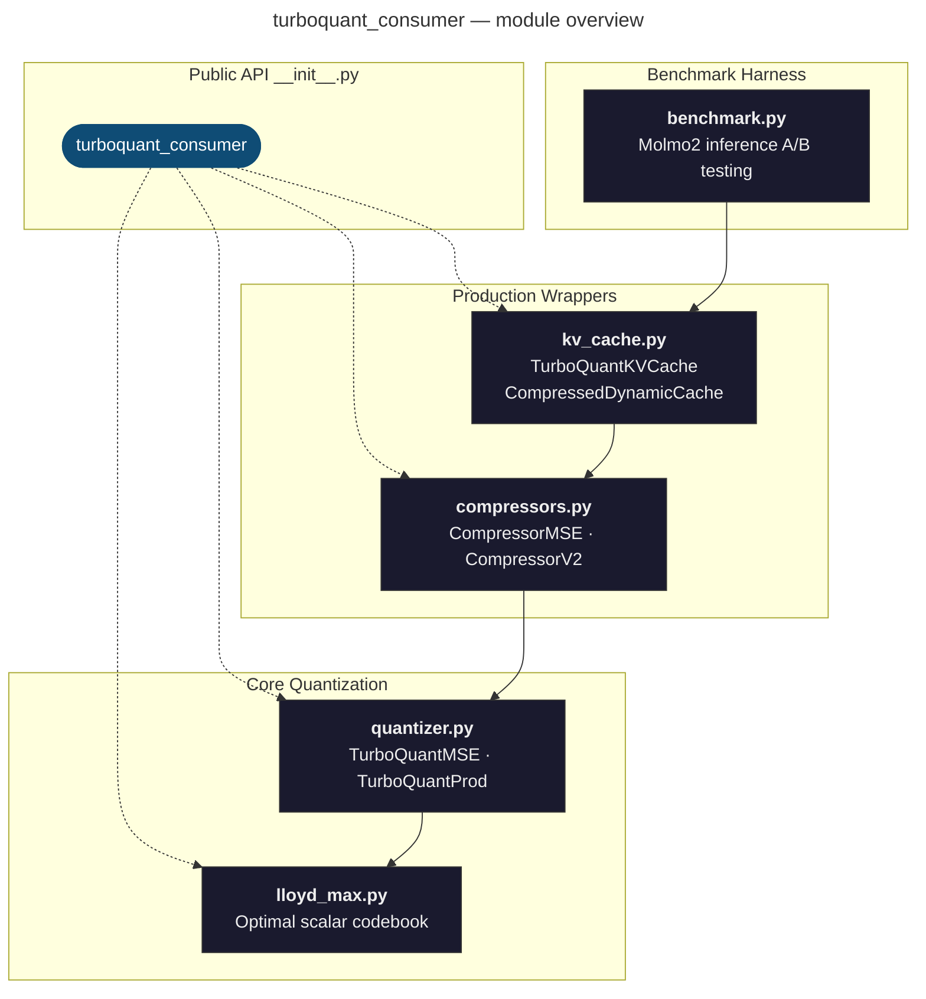

---

## Dependency Flow Between Modules

No circular dependencies — the graph is a strict DAG from foundational math (`lloyd_max`) up through integration (`kv_cache`) and finally the CLI harness (`benchmark`).

---

## Public API Surface

Everything exported from `__init__.py`, grouped by purpose:

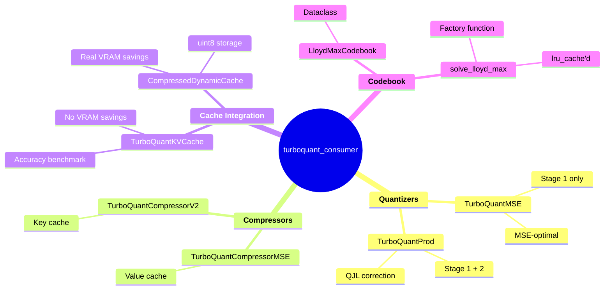

---

## Module Deep Dives

### 1. `lloyd_max.py` — Optimal Scalar Codebook

Solves the Lloyd-Max conditions for scalar quantization of Beta-distributed coordinates (the distribution that emerges after random orthogonal rotation of unit vectors).

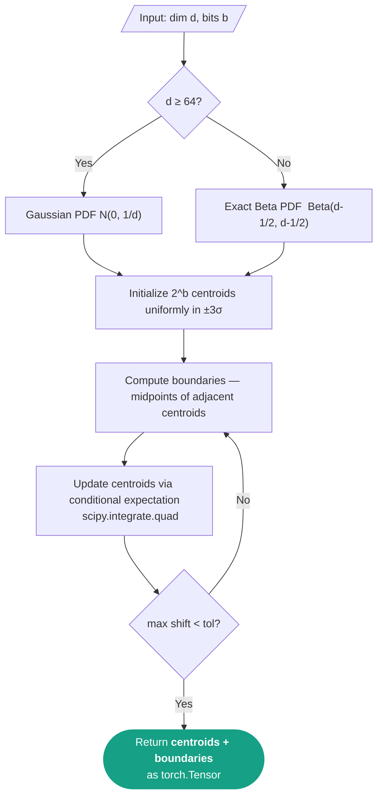

**Key types:**

| Symbol | Type | Role |
|---|---|---|
| `solve_lloyd_max()` | Function | Computes optimal centroids & boundaries for (dim, bits). Results are `@lru_cache`d. |
| `LloydMaxCodebook` | Dataclass | Holds precomputed centroids/boundaries. `quantize()` → `torch.bucketize`; `dequantize()` → centroid lookup. |

---

### 2. `quantizer.py` — Two-Stage Vector Quantizer

The core TurboQuant algorithm: random orthogonal rotation + Lloyd-Max scalar quantization (Stage 1), with optional QJL residual correction (Stage 2).

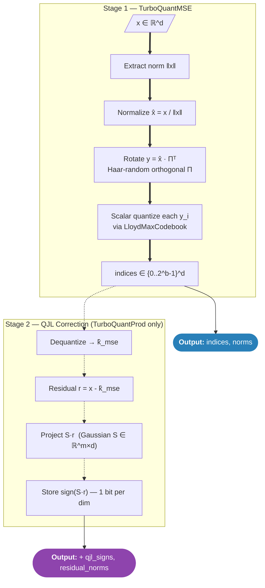

**Inner-product estimator** (Stage 2):

$$\langle q, k \rangle \;\approx\; \langle q,\, \hat{k}_{\text{mse}} \rangle \;+\; \|r\| \cdot \sqrt{\tfrac{\pi}{2}} \cdot \tfrac{1}{m} \cdot \langle S q,\; \text{sign}(S r) \rangle$$

| Class | Bits Used | Output | Best For |
|---|---|---|---|
| `TurboQuantMSE` | All *b* bits → Lloyd-Max | `(indices, norms)` | **Value cache** — reconstruction quality |
| `TurboQuantProd` | *(b−1)* Lloyd-Max + 1 QJL | `(indices, norms, qjl_signs, residual_norms)` | **Key cache** — unbiased Q·Kᵀ estimation |

**Bit budget allocation** — the key design tradeoff at 3-bit:

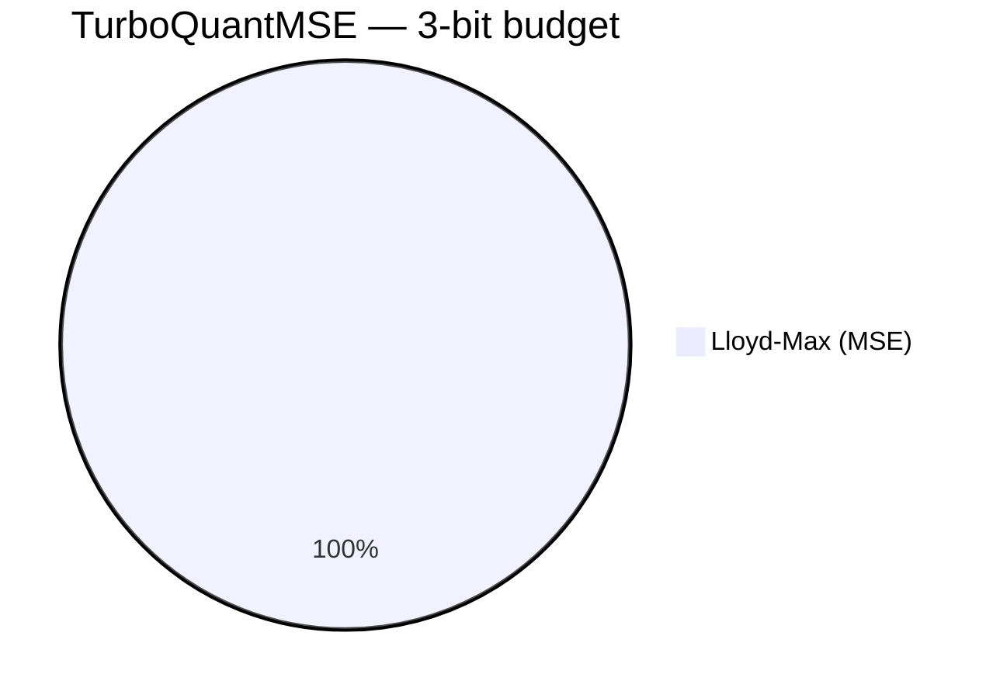

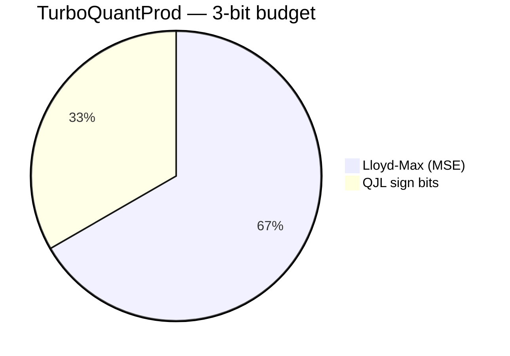

---

### 3. `compressors.py` — Production Tensor Wrappers

Adapts the raw quantizers to real model tensor shapes `(batch, heads, seq_len, head_dim)`, handling dtype conversion and device placement.

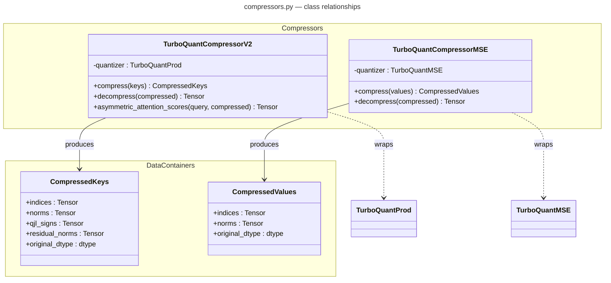

| Compressor | Quantizer | Target | Special Method |
|---|---|---|---|
| `TurboQuantCompressorV2` | `TurboQuantProd` | Key cache | `asymmetric_attention_scores()` — computes Q·Kᵀ directly from compressed keys without full decompression |
| `TurboQuantCompressorMSE` | `TurboQuantMSE` | Value cache | — |

---

### 4. `kv_cache.py` — HuggingFace Cache Integration

Two integration modes that non-invasively monkey-patch `DynamicCache.update()`:

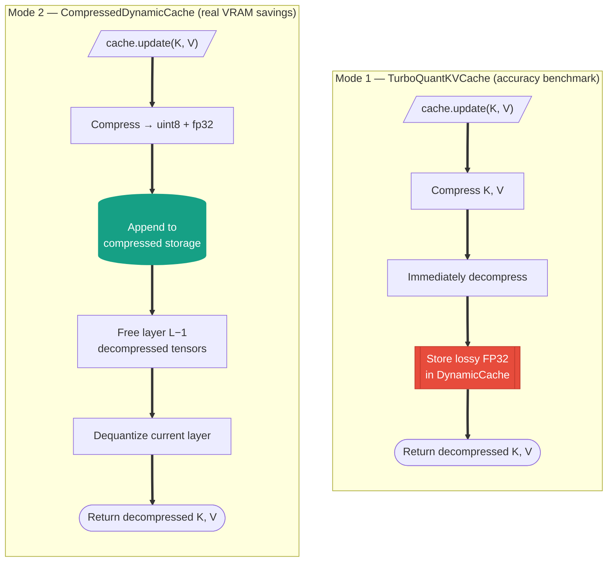

**Memory model** (CompressedDynamicCache, head_dim=128):

**TQ3 (3-bit, unpacked) — 132 bytes, 1.94x compression:**

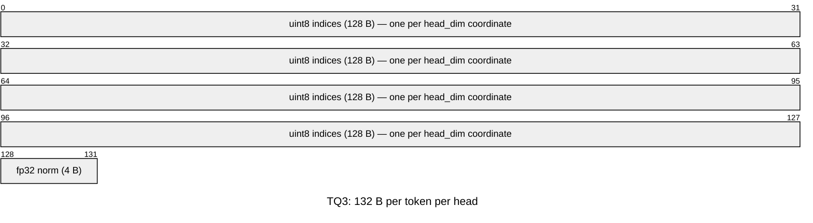

**TQ4 (4-bit, nibble-packed) — 68 bytes, 3.76x compression:**

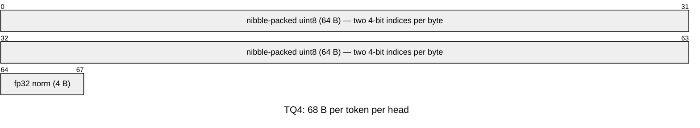

> **Why TQ4 over TQ3 packing?** TQ4 nibble packing is trivial (`(a << 4) | b`)
> and gives 3.76x compression with ~97% cosine similarity. TQ3 bit-packing (3-bit
> values crossing byte boundaries) is hard — no PyTorch/Triton implementation exists.
> The 30% extra compression isn't worth a custom kernel at this stage.

> **Why fp32 norms?** fp16 norms caused garbled output at 10K+ token sequences.
> The 0.01% per-vector precision loss accumulated across 36 transformer layers,
> flipping low-confidence token predictions. The 2 extra bytes per vector are
> negligible.

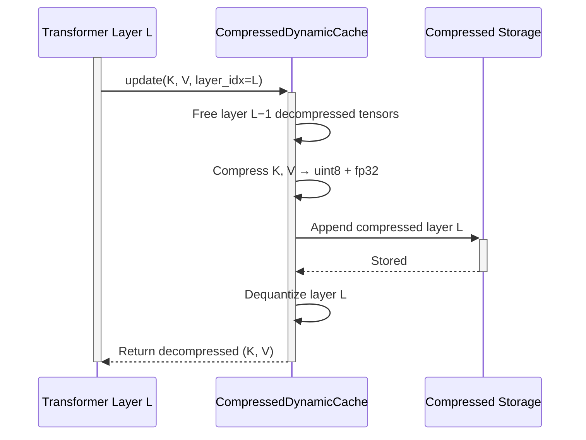

Both wrappers use the same integration pattern: save the original `update()` method, replace it with a wrapper, and expose `restore()` to undo the patch.

**Cache wrapper lifecycle** — the monkey-patch state machine applies to both `TurboQuantKVCache` and `CompressedDynamicCache`:

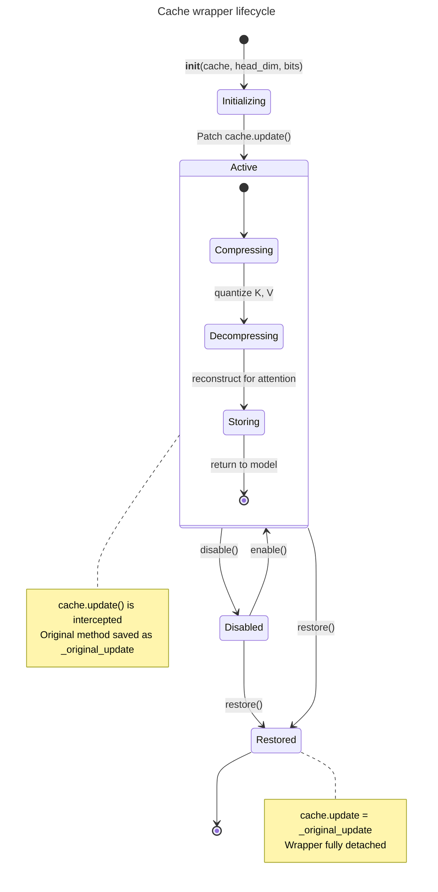

---

### 5. `benchmark.py` — CLI Benchmark Harness

Orchestrates end-to-end A/B testing on Molmo2 models via HuggingFace `transformers`.

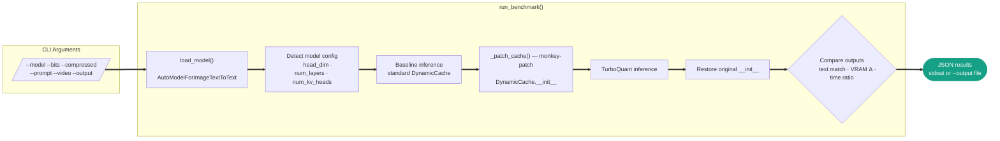

---

## End-to-End Data Flow

From raw KV tensors to compressed storage and back:

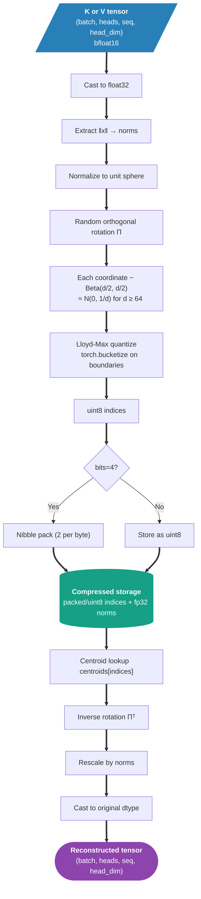

---

## Compression Mode Comparison

---

## Key Design Decisions

| Decision | Rationale |
|---|---|
| **MSE-only for drop-in mode** | Standard attention does `Q @ K.T` on decompressed keys, so QJL correction bits are wasted. Full 3-bit MSE gives ~95% cosine similarity vs ~87% with 2-bit MSE + 1-bit QJL. |
| **TQ4 nibble packing over TQ3 bit-packing** | 4-bit indices pack trivially (2 per byte via bit-shift). 3-bit indices cross byte boundaries — no PyTorch/Triton implementation exists. TQ4 gives 3.76x compression with ~97% quality vs TQ3's 4.92x at ~95%. The 30% gap isn't worth a custom kernel. |
| **fp32 norms, not fp16** | fp16 norm precision loss compounds across 36 transformer layers, flipping low-confidence logits at 10K+ token sequences. fp32 costs only 2 extra bytes per vector (1.94x → 1.94x for TQ3, negligible for TQ4). |
| **Non-invasive monkey-patching** | Avoids subclassing `DynamicCache`, which is fragile across `transformers` versions. The wrapper saves and restores the original method. |
| **`@lru_cache` on Lloyd-Max** | A 32-layer model creates 64 compressors (K+V). Without caching, `scipy.integrate.quad` would run for 2+ minutes at init. |
| **Lazy one-layer decompression** | `CompressedDynamicCache` frees the previous layer's FP32 tensors when the next layer updates, keeping peak VRAM to one decompressed layer at a time. |
| **Haar-random rotation via QR** | QR decomposition of a Gaussian matrix produces a uniformly distributed orthogonal matrix, ensuring coordinates are i.i.d. Beta-distributed. |
